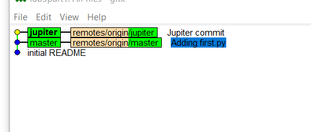
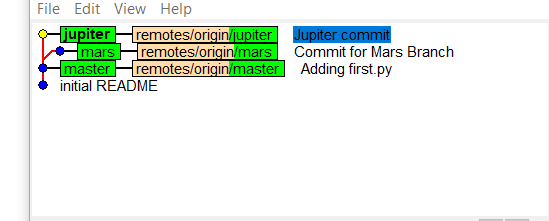
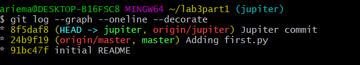
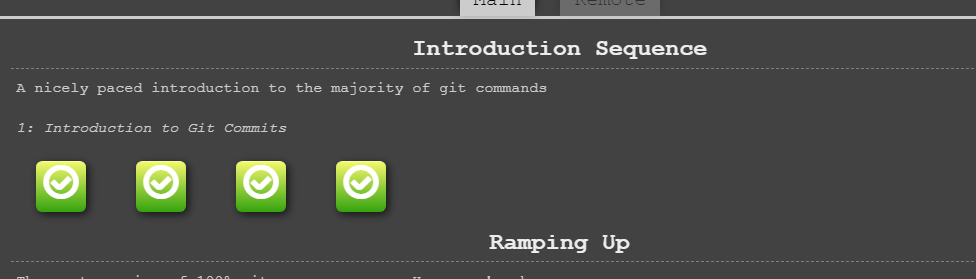

## Part 1
### Link to lab2part1: [https://github.com/ariema/lab2part1](https://github.com/ariema/lab2part1)
### Branching Diagrams
### gitk: 
### 
### gitk -all: 
### 
## git log command:
### 

## Part 2
### Link to forked Spoon-knife: [https://github.com/ariema/Spoon-Knife](https://github.com/ariema/Spoon-Knife)
###Learning git branching:
### 

## Part 3
