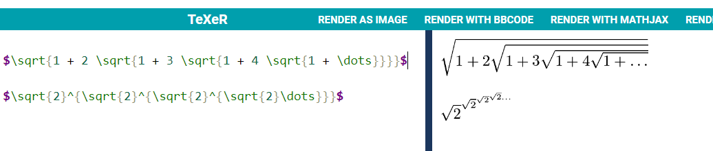
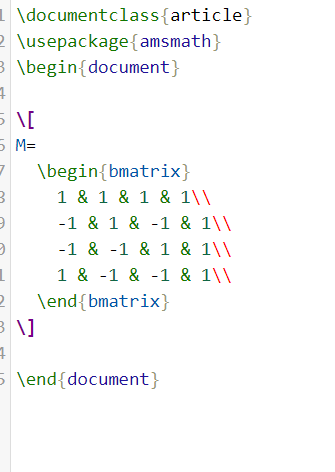
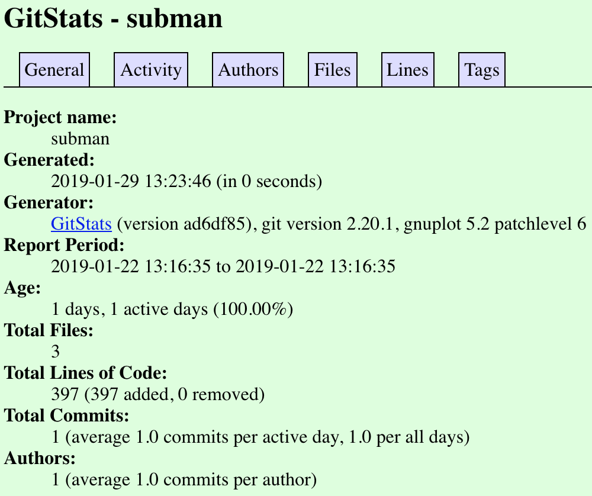
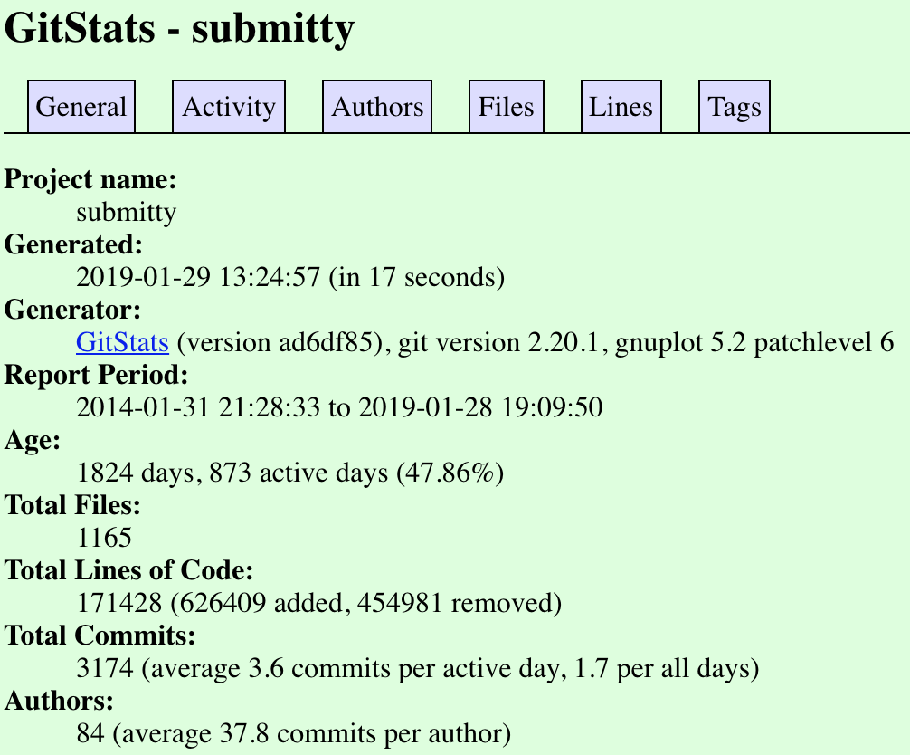
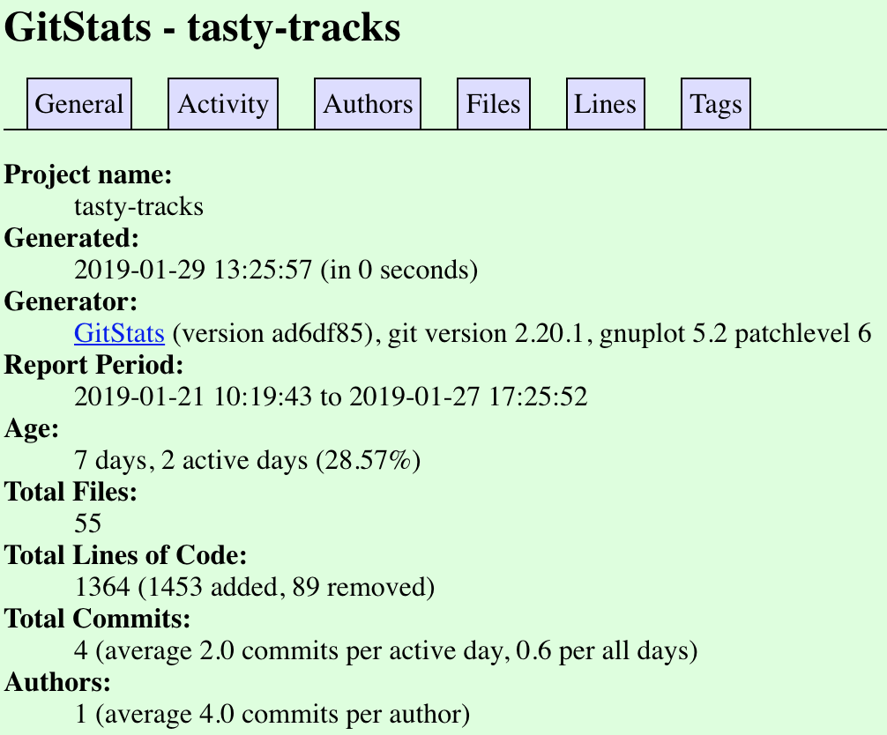
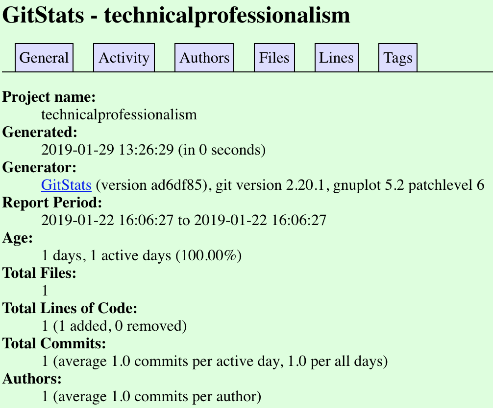

## Part 0

### Project wiki page: [https://github.com/ariema/Lab4_Project/wiki](https://github.com/ariema/Lab4_Project/wiki)

### Latex equations:  
<br>

### Latex Hadamard Matrix: 
   <br>

## Part 1
### Subman

* Number of contributers: 1
* Lines of code: 396
* First commit:
  ```
  commit 6f54a402c42f3172591bfd158e9886fb3211f32e (HEAD -> master, origin/master, origin/HEAD)
  Author: ChBoyShPd <32677918+ChBoyShPd@users.noreply.github.com>
  Date:   Tue Jan 22 13:16:35 2019 -0500
  
  Initial commit
  ```
* Latest commit:
  ```
  commit 6f54a402c42f3172591bfd158e9886fb3211f32e (HEAD -> master, origin/master, origin/HEAD)
  Author: ChBoyShPd <32677918+ChBoyShPd@users.noreply.github.com>
  Date:   Tue Jan 22 13:16:35 2019 -0500
  
  Initial commit
  ```
* Branches: 1
* [Gource Video](https://youtu.be/ofq0f0YRoDY)
	* Leader: ChBoyShPd
* Gitstat Screenshot: 
* Comparison: Lines of code is off by one. Perhaps gitstats calculates it in a different manner

### Submitty
* Number of contributers: 3174
* Lines of code: 425431
* First commit:
  ```
  commit d81d95fb1a40065889567e084fcb6bf92ff7cace
  Author: Jesse Freitas <freitas.jesse@gmail.com>
  Date:   Fri Jan 31 21:28:33 2014 -0500

      init commit
  ```
* Latest commit:
  ```
  commit 619a6eb1c030284a354fd4cd2fe5f4301f3a298b (HEAD -> master, origin/master, origin/HEAD)
  Author: emaicus <maicue@rpi.edu>
  Date:   Mon Jan 28 19:09:50 2019 -0500

      [Bugfix] Move mouse to origin before centering (#3238)
  ```
* Branches: 58
* [Gource Video](https://youtu.be/iuhjHG7eck4)
	* No clear leader
* Gitstat Screenshot: 
* Comparison: Number of lines of code is way less on gitstats than from using git ls-files

### Syllabuild
* Number of contributers:  0
* Lines of code: 0
* First commit: N/A
* Latest commit: N/A
* Branches: 1
* Gource Video: N/A
* Gitstat Screenshot: N/A

### Tasty Tracks
* Number of contributers: 1
* Lines of code: 1565
* First commit:
  ```
  commit 00ebe336a8e897301bfbb1e5cbdaab5dbe8ecb09
  Author: Justin Carlson <jrcarlson8@gmail.com>
  Date:   Mon Jan 21 10:19:43 2019 -0500

      Initial commit
  ```
* Latest commit: 
  ```
  commit a875732a30013489c60ee29b194dd689236c1e04 (HEAD -> master, origin/master, origin/HEAD)
  Author: Justin Carlson <jrcarlson8@gmail.com>
  Date:   Sun Jan 27 17:25:52 2019 -0500

      Update README.md
  ```
* Branches: 1
* [Gource Video](https://youtu.be/FHbWsK3FhQ8)
	* Leader: Justin Carlson
* Gitstat Screenshot: 
* Comparison: Number of lines of code is again off and is less on gitstats. 

### Technical Professionalism
* Number of contributers: 1
* Lines of code: 0
* First commit:
  ```
  commit e1f01c509795587d9d431fc7b20341a4ab9482f5 (HEAD -> master, origin/master, origin/HEAD)
  Author: Milena Xochitl Gonzalez <gonzam4@rpi.edu>
  Date:   Tue Jan 22 16:06:27 2019 -0500

      Initial commit
  ```
* Latest commit:
  ```
  commit e1f01c509795587d9d431fc7b20341a4ab9482f5 (HEAD -> master, origin/master, origin/HEAD)
  Author: Milena Xochitl Gonzalez <gonzam4@rpi.edu>
  Date:   Tue Jan 22 16:06:27 2019 -0500

      Initial commit
  ```
* Branches: 1
* [Gource Video](https://youtu.be/leZG7VM6MEY)
	* Leader: Milena Gonzalez
* Gitstat Screenshot: 
* Gitstats finds a line of code where git ls-files does not. 


## Part 2

### Links: [markdown.py](markdown.py), [test_markdown_unittest.py](test_markdown_unittest.py)

First, we added `convert_header` in order to convert header tags with regular expressions:

```python
def convert_headers(line):
    '''
    Converts
        ### ... -> <h3>...</h3>
        ## ... -> <h2>...</h2>
        # ... -> <h1>...</h1>
    Strips leading and trailing whitespace from the header declaration
    '''
    line = re.sub(r'^\s*###\s*(.*)\s*$', r'<h3>\1</h3>', line)
    line = re.sub(r'^\s*##\s*(.*)\s*$', r'<h2>\1</h2>', line)
    line = re.sub(r'^\s*#\s*(.*)\s*$', r'<h1>\1</h1>', line)
    return line
```

To handle blockquotes we had to know whether the previous line had a blockquote: 

```python
def strip_blockquote(line):
    if line.startswith('>'):
        return re.sub(r'^\>\s?(.*)$', r'\1', line), True
    else:
        return line, False

prev_is_blockquote = False
for line in fileinput.input():
    line = line.rstrip() 
    line, is_blockquote = strip_blockquote(line)
    line = convert_headers(line)
    line = convert_strong(line)
    line = convert_em(line)
    if not line.startswith('<h'):
        line = '<p>' + line + '</p>'
    if not prev_is_blockquote and is_blockquote:
        line = '<blockquote>' + line
    if prev_is_blockquote and not is_blockquote:
        line = '</blockquote>' + line
    prev_is_blockquote = is_blockquote
    print(line)
if prev_is_blockquote:
    print('</blockquote>')
```

Then we added test cases for `h1`, `h2`, `h3`, and `blockquote`.

### Example usage:
```
**bolded**
para1
para2
> here is a _blockquote_
> with **bold text**
>
# Header
## Small header
### Tiny header
<p><strong>bolded</strong></p>
<p>para1</p>
<p>para2</p>
<blockquote><p>here is a <em>blockquote</em></p>
<p>with <strong>bold text</strong></p>
<p></p>
</blockquote><h1>Header</h1>
<h2>Small header</h2>
<h3>Tiny header</h3>
```