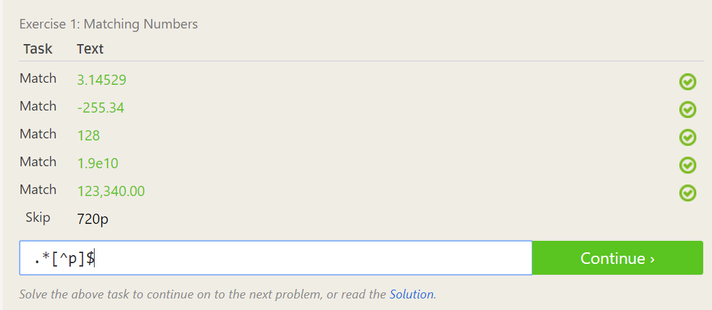
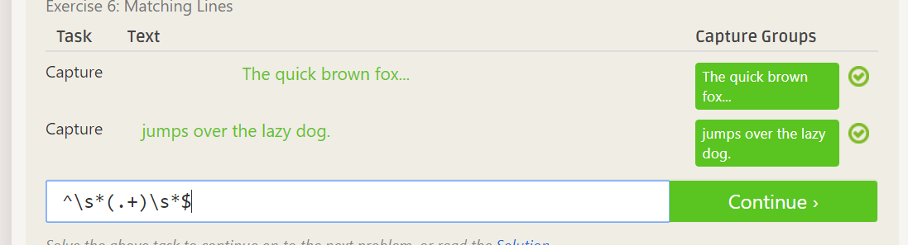
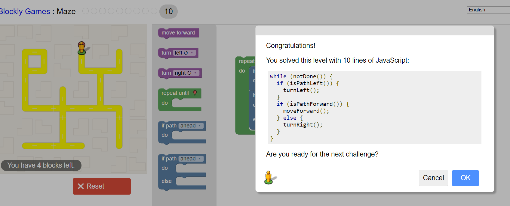

## Part 3: Reading
### 2. Suggestions to answer questions:
###    	1. Try to word the answer in simple terms so others can grasp your idea     
###     2. Providing a concrete exmaple to the question may make your answer more clear
### 3. Paragraph on chapter 3
### From this article, I learned that people need to be careful with what they produce and tinker with on the internet. The student Jesse, named in the article, altered an intranet search engine and then was sued by the RIAA for copyright infringement.  An intranet search engine provides users with information that is related to the university or business that they are a part of. The RIAA claimed that since Jesse's search engine contained music files, which just happened to be in other student’s public folders, that he willfully violated copyright laws. Jesse had no previous knowledge that his actions were unlawful and would eventually set him back 12,000 dollars as a settlement. Clearly, it is important that students are careful with what they create or change with their knowledge. Therefore, the main take away is to be aware of what you are doing, the implications that it has, and that other parties may be affected.

## Part 4: Linux
### 
 
## Part 5 Regex
### Part 2:
###     1. 
###     2. 
###     3. 
###     4. 
###     5. 
###     6. 
###     7. 
### Part 3:
###     1.
### 
###     2.
### 

###     3. 
### 
###     4. 

## Part 6: Blockly
###     6. 
### 
###     7.
### 

## Part 7: Reflection
### To do this activity I looked through the list provided for names that I recognized. I think it would be neat to work on an open source project that involves a tool that I currently use or have used. There were 2 projects on the list that jumped out at me. First was openMPI. I have used this in operating systems to pass messages between process in a program. They also use c++, which is language I am familiar with. Another project that sounds interesting is Eclipse. Even though this is an incredibly large project I think it would be cool to create some kind of a plugin. Clearly, there are lots of compelling open source projects out there and I am excited to choose one and start developing.
