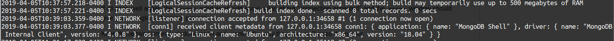
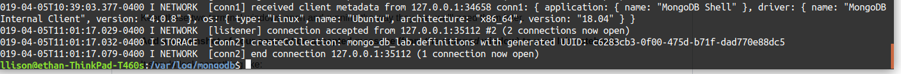
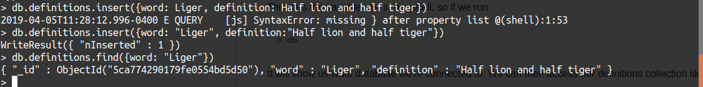
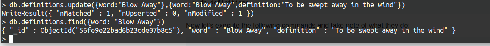
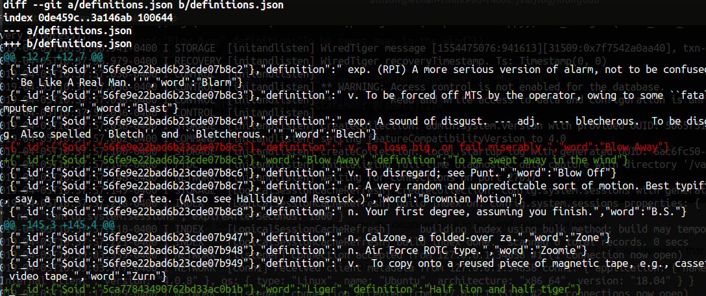
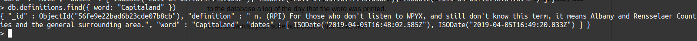

# Lab10: Databases

## Checkpoint 1:
Connection accepted message: 

## Checkpoint 2:
CreateCollection method: 

## Checkpoint 3:
Created record called "Liger":  

Changed "Blow Away" record:  

git dff shows the updates and changes:

## Checkpoint 4:
Script to run all necessary commands: 
[checkpoint4.py](checkpoint4.py)

Output of checkpoint4 script with all necessary records printed: 
[checkpoint4.txt](checkpoint4.txt)

## Checkpoint 5:

Script to find random word and update timestamp:
[checkpoint5.py](checkpoint5.py)
THe first duplicate I found was the word capitland, as you can see it has 2 timestamps: 
