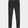

# Lab 11: Tensor FLow
## Checkpoint 1

Plot and tensor flow version shown below:

  

## Checkpoint 2:

Results for images 9000 - 9014:

## Checkpoint 3:

# Original image 1:

Greyscale and sized:

Classification:

# Original image 2:

Greyscale and sized:

Classification:

# Original image 3:

Greyscale and sized:

Classification:

From above you can see that we correctly identified the first and third image, but did not do so well on the second. 