# Lab 5: Build Systems

# Part 1:

## Step 1: A Basic Starting Point 

### Code Updates: <br>
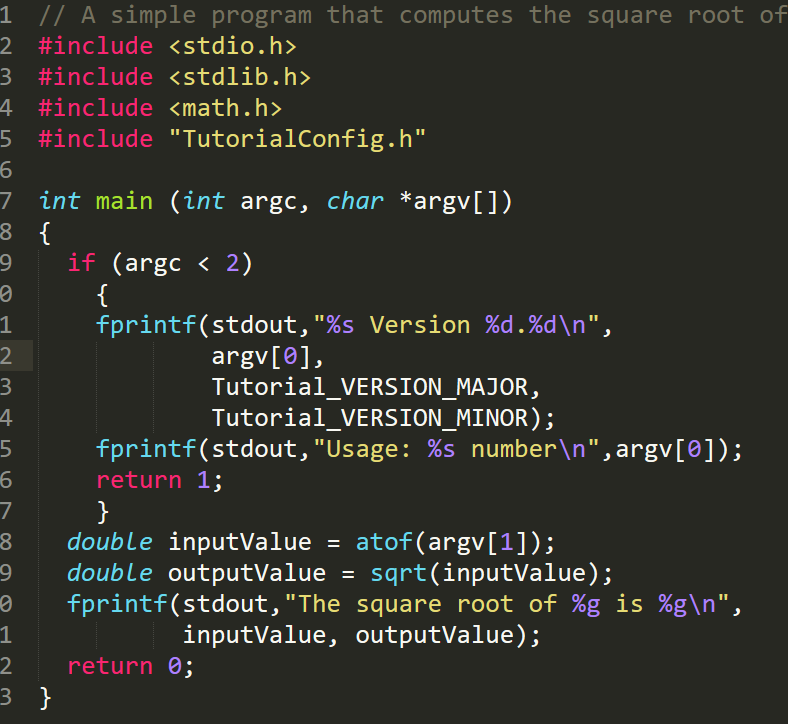

### Terminal: <br>


## Step 2: Adding a Library 

### Code Updates: <br>
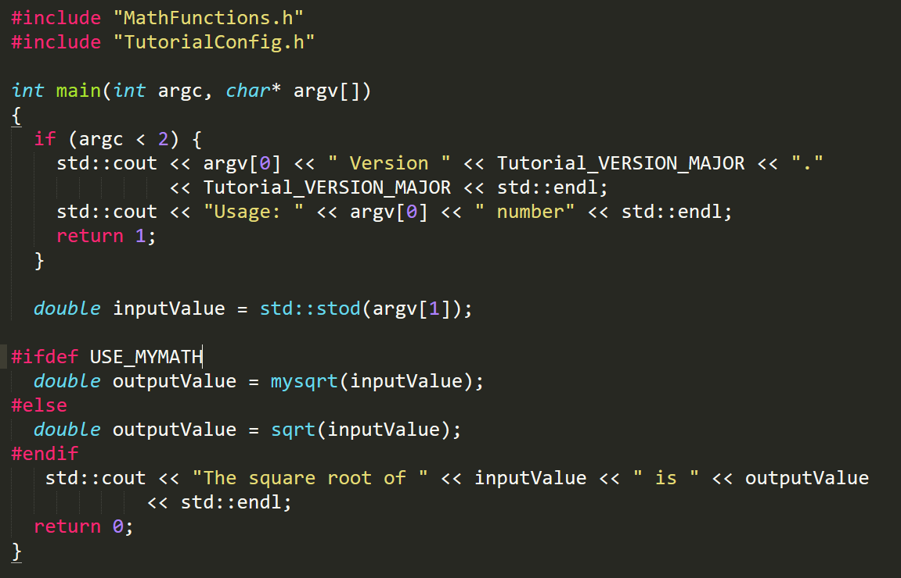

### Terminal: <br>
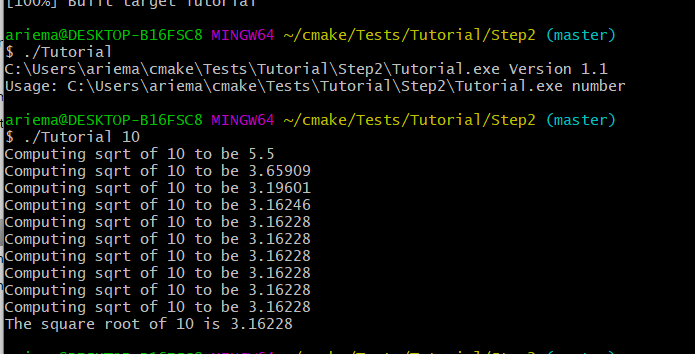


## Step 3: Installing and Testing

### Code Updates: <br>
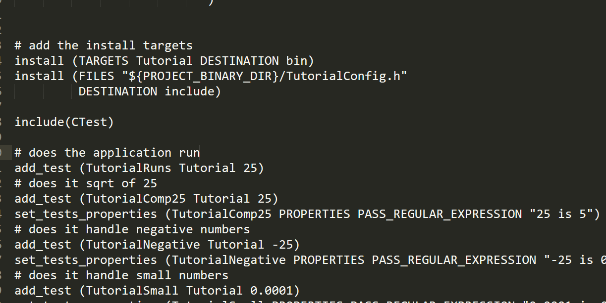

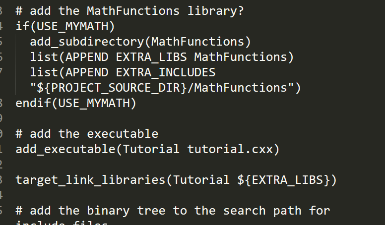

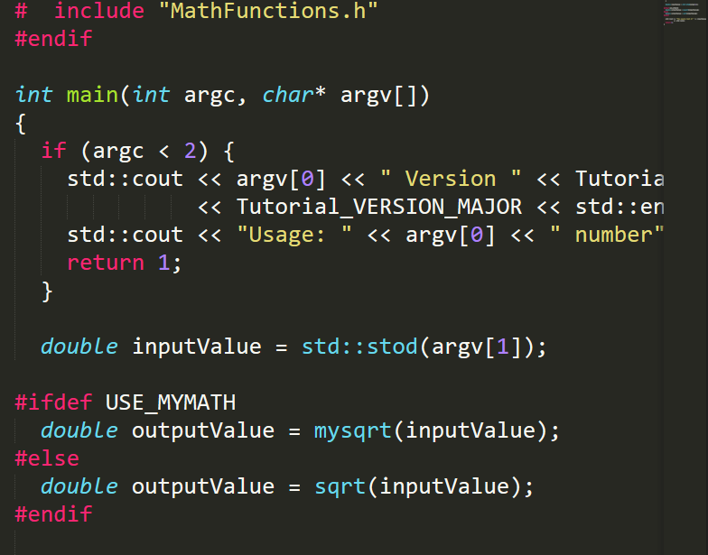

### Terminal: <br>


## Step 4: Adding System Introspection

### Code Updates: <br>
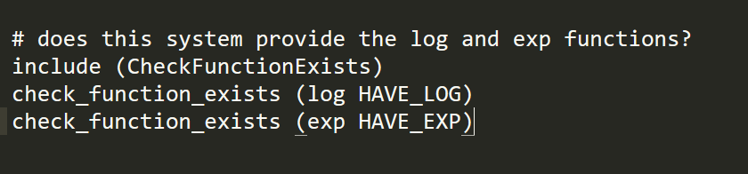

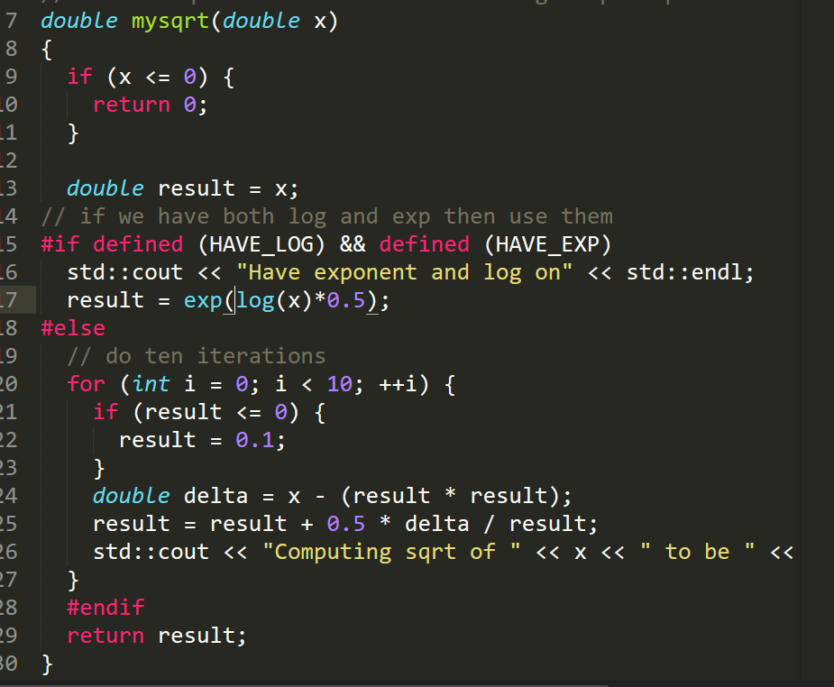

### Terminal: <br>
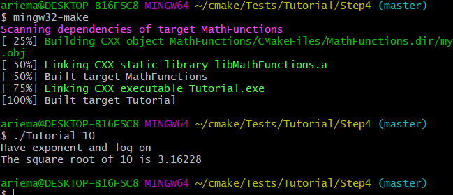

## Step 5: Adding a Generated File and Generator

### Code Updates: <br>
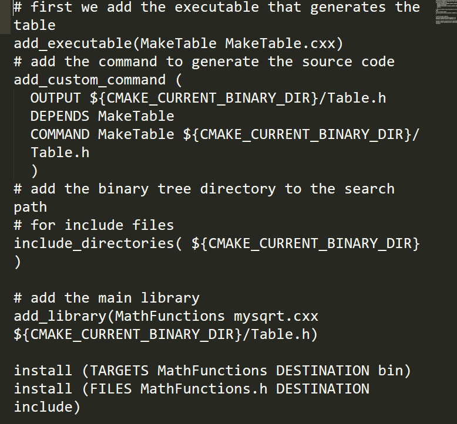

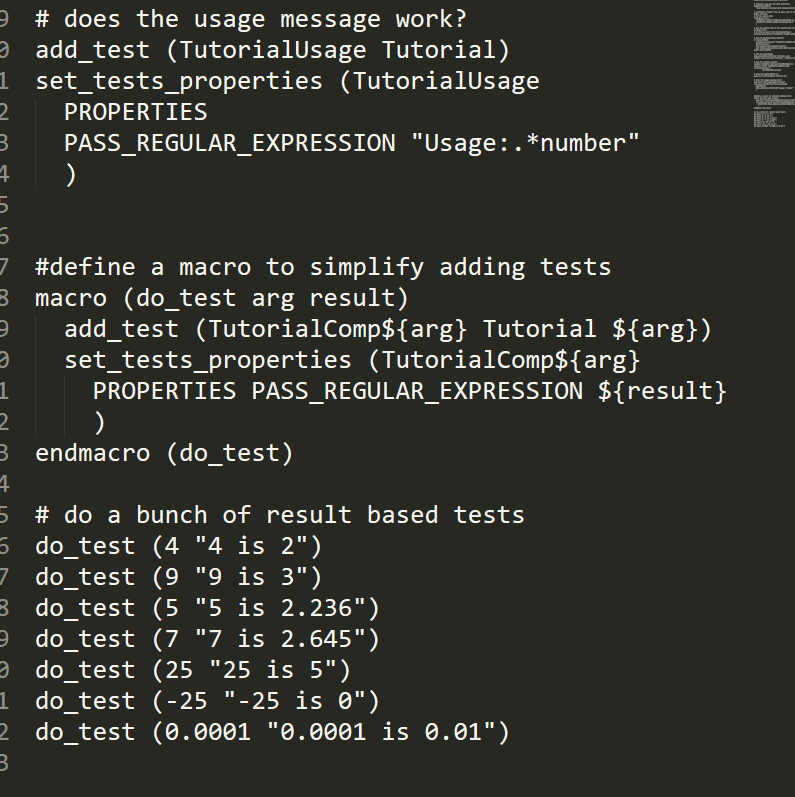

### Terminal: <br>
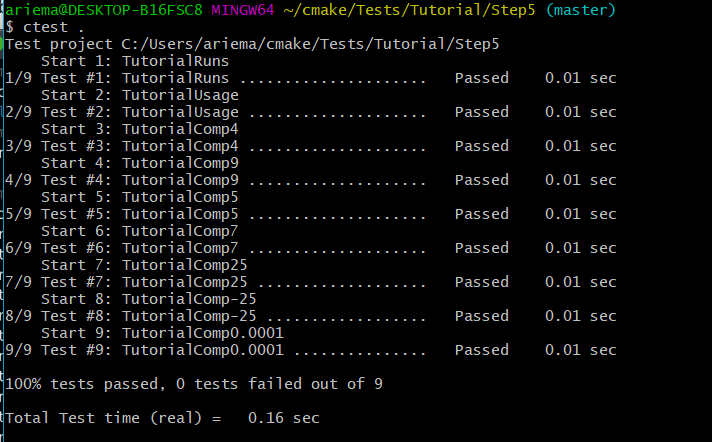


# Part 2: 

## MakeFile:
```makefile
all: static_block dynamic_block
block.o: ./source/block.c
	gcc -c ./source/block.c -o ./bin/block.o

libblock_static.a: block.o
	ar rcs ./bin/libblock_static.a ./bin/block.o

libblock_dynamic.so: block.o
	gcc -shared ./bin/block.o -o ./bin/libblock_dynamic.so

program.o: ./program.c
	gcc -c ./program.c -o ./bin/program.o

static_block: program.o libblock_static.a
	gcc ./bin/program.o -L./bin -lblock_static -o ./bin/static_block

dynamic_block: program.o libblock_dynamic.so
	gcc ./bin/program.o -L./bin -l:libblock_dynamic.so -o ./bin/dynamic_block
```

<br>

## CMakeLists.txt:
```cmake
cmake_minimum_required(VERSION 3.0)
project(Lab5-part2)
include_directories(headers)

add_library(static STATIC source/block.c)
add_library(dynamic SHARED source/block.c)

add_executable(dynamic_block program.c)
target_link_libraries(dynamic_block dynamic)

add_executable(static_block program.c)
target_link_libraries(static_block static)
```
<br>

## Makefile created by CMake:
```makefile
# CMAKE generated file: DO NOT EDIT!
# Generated by "MinGW Makefiles" Generator, CMake Version 3.14

# Default target executed when no arguments are given to make.
default_target: all

.PHONY : default_target

# Allow only one "make -f Makefile2" at a time, but pass parallelism.
.NOTPARALLEL:


#=============================================================================
# Special targets provided by cmake.

# Disable implicit rules so canonical targets will work.
.SUFFIXES:


# Remove some rules from gmake that .SUFFIXES does not remove.
SUFFIXES =

.SUFFIXES: .hpux_make_needs_suffix_list


# Suppress display of executed commands.
$(VERBOSE).SILENT:


# A target that is always out of date.
cmake_force:

.PHONY : cmake_force

#=============================================================================
# Set environment variables for the build.

SHELL = cmd.exe

# The CMake executable.
CMAKE_COMMAND = "C:\Program Files\CMake\bin\cmake.exe"

# The command to remove a file.
RM = "C:\Program Files\CMake\bin\cmake.exe" -E remove -f

# Escaping for special characters.
EQUALS = =

# The top-level source directory on which CMake was run.
CMAKE_SOURCE_DIR = C:\Users\ariema\CSCI-49XX-OpenSource\Modules\BuildSystems\Lab-Example

# The top-level build directory on which CMake was run.
CMAKE_BINARY_DIR = C:\Users\ariema\CSCI-49XX-OpenSource\Modules\BuildSystems\Lab-Example\build

#=============================================================================
# Targets provided globally by CMake.

# Special rule for the target rebuild_cache
rebuild_cache:
	@$(CMAKE_COMMAND) -E cmake_echo_color --switch=$(COLOR) --cyan "Running CMake to regenerate build system..."
	"C:\Program Files\CMake\bin\cmake.exe" -S$(CMAKE_SOURCE_DIR) -B$(CMAKE_BINARY_DIR)
.PHONY : rebuild_cache

# Special rule for the target rebuild_cache
rebuild_cache/fast: rebuild_cache

.PHONY : rebuild_cache/fast

# Special rule for the target edit_cache
edit_cache:
	@$(CMAKE_COMMAND) -E cmake_echo_color --switch=$(COLOR) --cyan "Running CMake cache editor..."
	"C:\Program Files\CMake\bin\cmake-gui.exe" -S$(CMAKE_SOURCE_DIR) -B$(CMAKE_BINARY_DIR)
.PHONY : edit_cache

# Special rule for the target edit_cache
edit_cache/fast: edit_cache

.PHONY : edit_cache/fast

# The main all target
all: cmake_check_build_system
	$(CMAKE_COMMAND) -E cmake_progress_start C:\Users\ariema\CSCI-49XX-OpenSource\Modules\BuildSystems\Lab-Example\build\CMakeFiles C:\Users\ariema\CSCI-49XX-OpenSource\Modules\BuildSystems\Lab-Example\build\CMakeFiles\progress.marks
	$(MAKE) -f CMakeFiles\Makefile2 all
	$(CMAKE_COMMAND) -E cmake_progress_start C:\Users\ariema\CSCI-49XX-OpenSource\Modules\BuildSystems\Lab-Example\build\CMakeFiles 0
.PHONY : all

# The main clean target
clean:
	$(MAKE) -f CMakeFiles\Makefile2 clean
.PHONY : clean

# The main clean target
clean/fast: clean

.PHONY : clean/fast

# Prepare targets for installation.
preinstall: all
	$(MAKE) -f CMakeFiles\Makefile2 preinstall
.PHONY : preinstall

# Prepare targets for installation.
preinstall/fast:
	$(MAKE) -f CMakeFiles\Makefile2 preinstall
.PHONY : preinstall/fast

# clear depends
depend:
	$(CMAKE_COMMAND) -S$(CMAKE_SOURCE_DIR) -B$(CMAKE_BINARY_DIR) --check-build-system CMakeFiles\Makefile.cmake 1
.PHONY : depend

#=============================================================================
# Target rules for targets named static

# Build rule for target.
static: cmake_check_build_system
	$(MAKE) -f CMakeFiles\Makefile2 static
.PHONY : static

# fast build rule for target.
static/fast:
	$(MAKE) -f CMakeFiles\static.dir\build.make CMakeFiles/static.dir/build
.PHONY : static/fast

#=============================================================================
# Target rules for targets named dynamic

# Build rule for target.
dynamic: cmake_check_build_system
	$(MAKE) -f CMakeFiles\Makefile2 dynamic
.PHONY : dynamic

# fast build rule for target.
dynamic/fast:
	$(MAKE) -f CMakeFiles\dynamic.dir\build.make CMakeFiles/dynamic.dir/build
.PHONY : dynamic/fast

#=============================================================================
# Target rules for targets named dynamic_block

# Build rule for target.
dynamic_block: cmake_check_build_system
	$(MAKE) -f CMakeFiles\Makefile2 dynamic_block
.PHONY : dynamic_block

# fast build rule for target.
dynamic_block/fast:
	$(MAKE) -f CMakeFiles\dynamic_block.dir\build.make CMakeFiles/dynamic_block.dir/build
.PHONY : dynamic_block/fast

#=============================================================================
# Target rules for targets named static_block

# Build rule for target.
static_block: cmake_check_build_system
	$(MAKE) -f CMakeFiles\Makefile2 static_block
.PHONY : static_block

# fast build rule for target.
static_block/fast:
	$(MAKE) -f CMakeFiles\static_block.dir\build.make CMakeFiles/static_block.dir/build
.PHONY : static_block/fast

program.obj: program.c.obj

.PHONY : program.obj

# target to build an object file
program.c.obj:
	$(MAKE) -f CMakeFiles\dynamic_block.dir\build.make CMakeFiles/dynamic_block.dir/program.c.obj
	$(MAKE) -f CMakeFiles\static_block.dir\build.make CMakeFiles/static_block.dir/program.c.obj
.PHONY : program.c.obj

program.i: program.c.i

.PHONY : program.i

# target to preprocess a source file
program.c.i:
	$(MAKE) -f CMakeFiles\dynamic_block.dir\build.make CMakeFiles/dynamic_block.dir/program.c.i
	$(MAKE) -f CMakeFiles\static_block.dir\build.make CMakeFiles/static_block.dir/program.c.i
.PHONY : program.c.i

program.s: program.c.s

.PHONY : program.s

# target to generate assembly for a file
program.c.s:
	$(MAKE) -f CMakeFiles\dynamic_block.dir\build.make CMakeFiles/dynamic_block.dir/program.c.s
	$(MAKE) -f CMakeFiles\static_block.dir\build.make CMakeFiles/static_block.dir/program.c.s
.PHONY : program.c.s

source/block.obj: source/block.c.obj

.PHONY : source/block.obj

# target to build an object file
source/block.c.obj:
	$(MAKE) -f CMakeFiles\static.dir\build.make CMakeFiles/static.dir/source/block.c.obj
	$(MAKE) -f CMakeFiles\dynamic.dir\build.make CMakeFiles/dynamic.dir/source/block.c.obj
.PHONY : source/block.c.obj

source/block.i: source/block.c.i

.PHONY : source/block.i

# target to preprocess a source file
source/block.c.i:
	$(MAKE) -f CMakeFiles\static.dir\build.make CMakeFiles/static.dir/source/block.c.i
	$(MAKE) -f CMakeFiles\dynamic.dir\build.make CMakeFiles/dynamic.dir/source/block.c.i
.PHONY : source/block.c.i

source/block.s: source/block.c.s

.PHONY : source/block.s

# target to generate assembly for a file
source/block.c.s:
	$(MAKE) -f CMakeFiles\static.dir\build.make CMakeFiles/static.dir/source/block.c.s
	$(MAKE) -f CMakeFiles\dynamic.dir\build.make CMakeFiles/dynamic.dir/source/block.c.s
.PHONY : source/block.c.s

# Help Target
help:
	@echo The following are some of the valid targets for this Makefile:
	@echo ... all (the default if no target is provided)
	@echo ... clean
	@echo ... depend
	@echo ... static
	@echo ... dynamic
	@echo ... dynamic_block
	@echo ... rebuild_cache
	@echo ... static_block
	@echo ... edit_cache
	@echo ... program.obj
	@echo ... program.i
	@echo ... program.s
	@echo ... source/block.obj
	@echo ... source/block.i
	@echo ... source/block.s
.PHONY : help


#=============================================================================
# Special targets to cleanup operation of make.

# Special rule to run CMake to check the build system integrity.
# No rule that depends on this can have commands that come from listfiles
# because they might be regenerated.
cmake_check_build_system:
	$(CMAKE_COMMAND) -S$(CMAKE_SOURCE_DIR) -B$(CMAKE_BINARY_DIR) --check-build-system CMakeFiles\Makefile.cmake 0
.PHONY : cmake_check_build_system
```
Size Observations: <br>
Makefile static version:  388,363 bytes <br>
Makefile dynamic version: 387,516 bytes <br>
CMake static version: 	  388,363 bytes <br>
CMake dynamic version:    387,506 bytes <br>

The statically linked version is slightly larger than the dynamic, but the difference is very small.

## Reuslts of Running the Program:
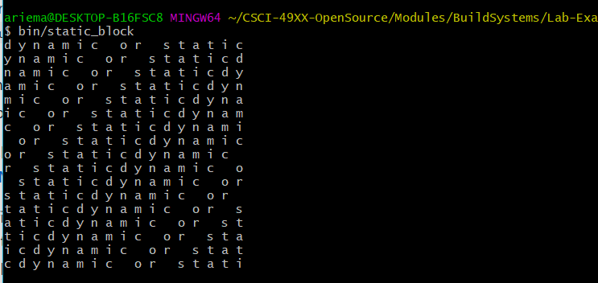