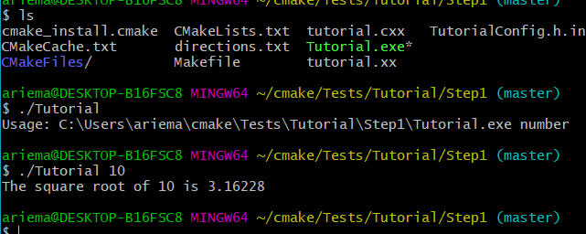
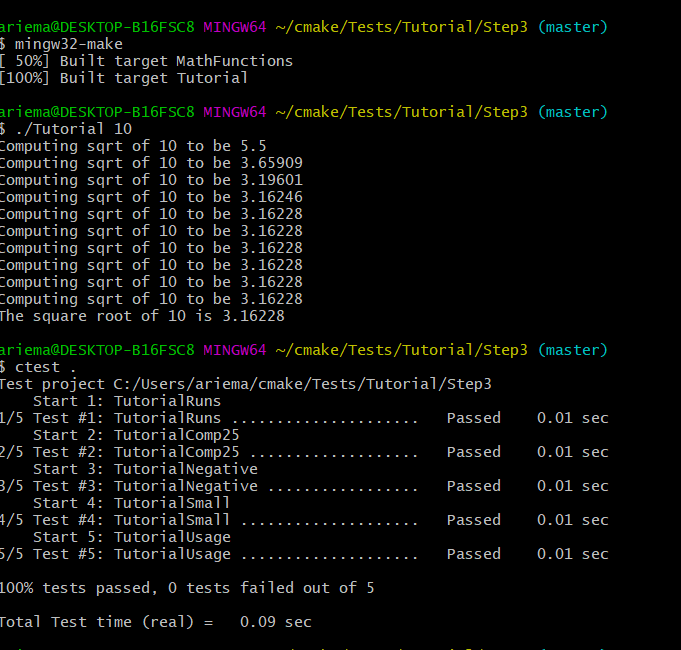

# Lab 5: Build Systems

# Part 1:

## Step 1: A Basic Starting Point 

### Code Updates: <br>


### Terminal: <br>



## Step 2: Adding a Library 

### Code Updates: <br>


### Terminal: <br>


## Step 3: Installing and Testing

### Code Updates: <br>


### Terminal: <br>



## Step 4: Adding System Introspection

### Code Updates: <br>


### Terminal: <br>


## Step 5: Adding a Generated File and Generator

### Code Updates: <br>


### Terminal: <br>


# Part 2: 

## MakeFile:
```makefile
all: static_block dynamic_block
block.o: ./source/block.c
	gcc -c ./source/block.c -o ./bin/block.o

libblock_static.a: block.o
	ar rcs ./bin/libblock_static.a ./bin/block.o

libblock_dynamic.so: block.o
	gcc -shared ./bin/block.o -o ./bin/libblock_dynamic.so

program.o: ./program.c
	gcc -c ./program.c -o ./bin/program.o

static_block: program.o libblock_static.a
	gcc ./bin/program.o -L./bin -lblock_static -o ./bin/static_block

dynamic_block: program.o libblock_dynamic.so
	gcc ./bin/program.o -L./bin -l:libblock_dynamic.so -o ./bin/dynamic_block
```

<br>

## CMakeLists.txt:
```cmake
cmake_minimum_required(VERSION 3.0)
project(Lab5-part2)
include_directories(headers)

add_library(static STATIC source/block.c)
add_library(dynamic SHARED source/block.c)

add_executable(dynamic_block program.c)
target_link_libraries(dynamic_block dynamic)

add_executable(static_block program.c)
target_link_libraries(static_block static)
```
<br>

