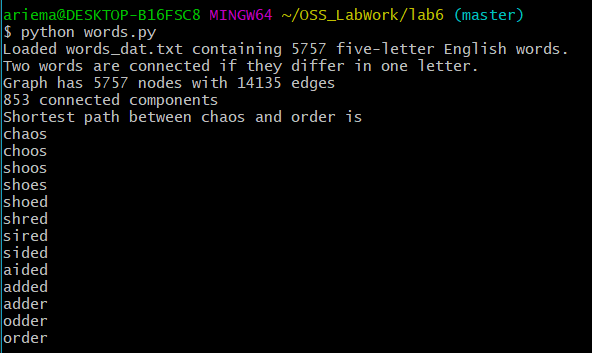
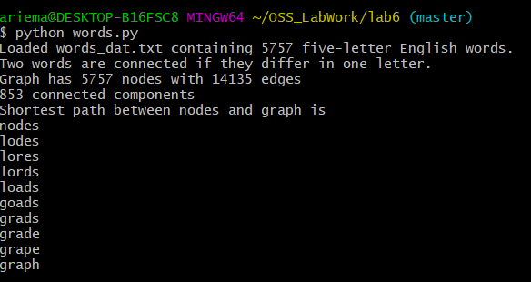
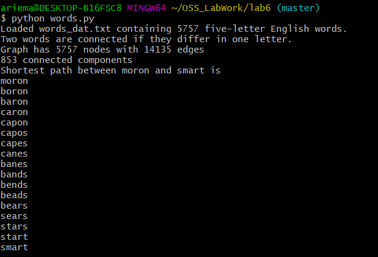
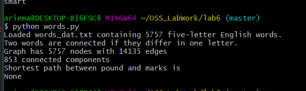
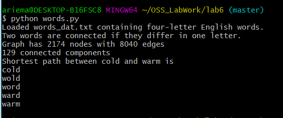
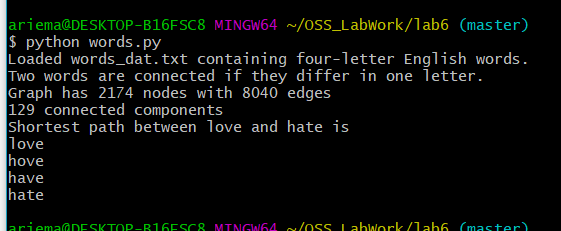
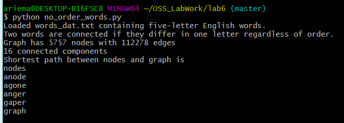
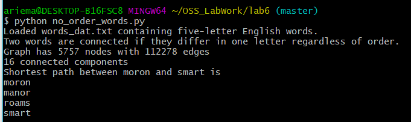

# Lab6: Scientific Computing

## Results for 5 letter words:

### chaos to order:

### nodes to graph:

### moron to smart:

### pound to marks:

## Results for 4 letter words:

### cold to warm:

### love to hate:

## Code for 4 letter solution:
Source code file: [4words.py](4words.py)

## Results for words without ordering

### chaos to order (no ordering):

### nodes to graph (no ordering):

### moron to smart (no ordering):

### pound to marks (no ordering):

## Code for NON-ORDERED solution:
Source code file: [no_order_words.py](no_order_words.py)
