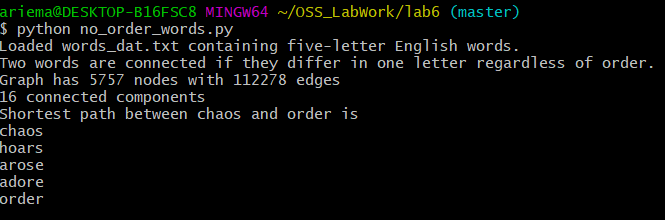
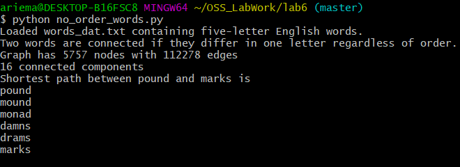

# Lab6: Scientific Computing

## Results for 5 letter words:

### chaos to order:


### nodes to graph:


### moron to smart:


### pound to marks:


## Results for 4 letter words:

### cold to warm:


### love to hate:


## Code for 4 letter solution:
Source code file: [4words.py](4words.py)

## Results for words without ordering

### chaos to order (no ordering):


### nodes to graph (no ordering):


### moron to smart (no ordering):


### pound to marks (no ordering):


## Code for NON-ORDERED solution:
Source code file: [no_order_words.py](no_order_words.py)

edit_distance_one function changed:
```python 
 for i in range(len(word)):
            left, c, right = word[0:i], word[i], word[i + 1:]
            j = lookup[c]  # lowercase.index(c)
            for cc in lowercase[j + 1:]:
                allperms = list(map("".join, itertools.permutations((left + cc + right))))
                for entry in allperms:
                    yield entry

```
Explanation: In this program I used itertools permutations function to find all permutations of a given candidate word so that the ordering would not matter. I made each of the 5 letter spots all possible letters one at a time and then calculated all possible permutations with these letters to try and find a valid word. I then mapped these words to strings and tested if they were in the dictionary given.