# Lab9: Virtualization

## Example00
Got Docker to run and display whale
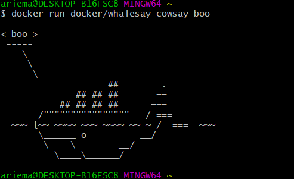

## Example01
Running ubuntu container
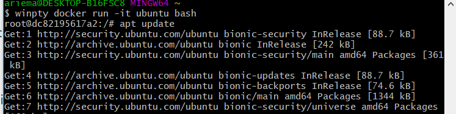

Vim installation

Using cowsay!
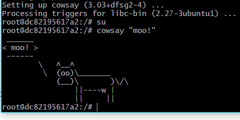

## Example02
rocket.chat is now an image
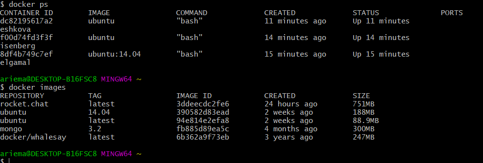

## Example03
Web display of python hello world
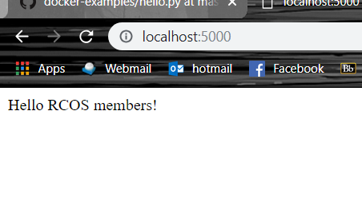

Shows the server running
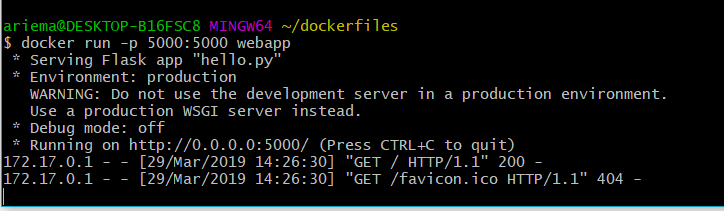

## Example04

Building Dockerfile
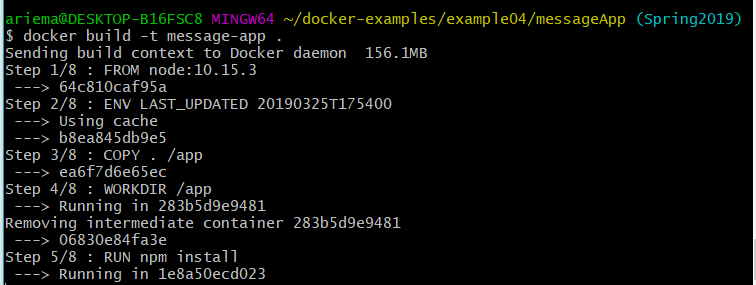

Lists all images on Docker host
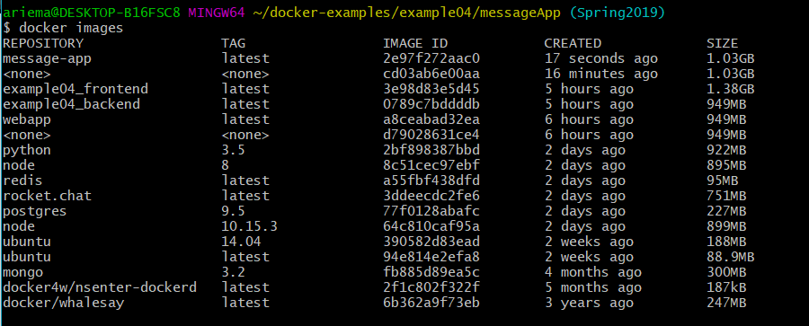

Shows error because cannot connect to database since we didnt provide it one
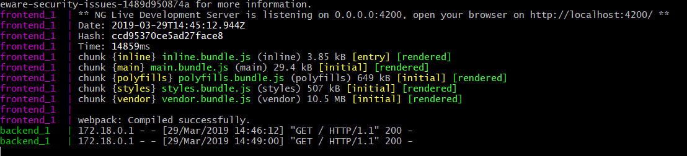

Usage of the messageApp: 

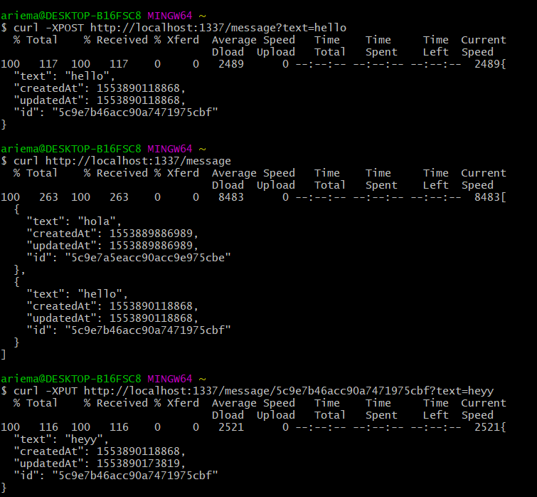
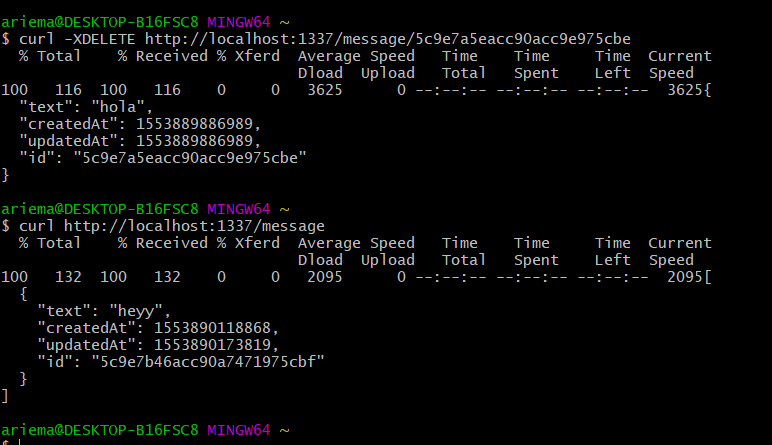