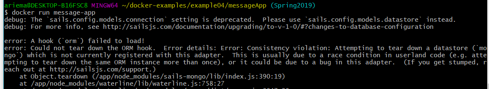

# Lab9: Virtualization

## Example00

Got Docker to run and display whale 

## Example01

Running ubuntu container 

Vim installation 

Using cowsay! 

## Example02

rocket.chat is now an image 

## Example03

Web display of python hello world 

Shows the server running 

## Example04

Building Dockerfile 

Lists all images on Docker host 

Shows error because cannot connect to database since we didnt provide it one 

Usage of the messageApp: 

